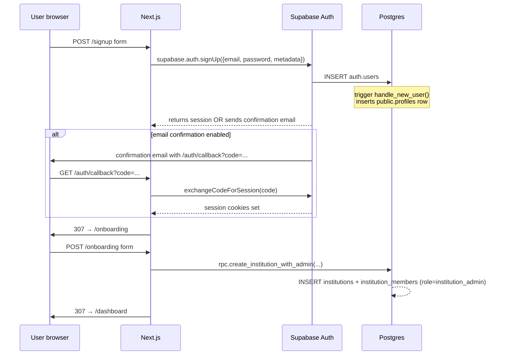
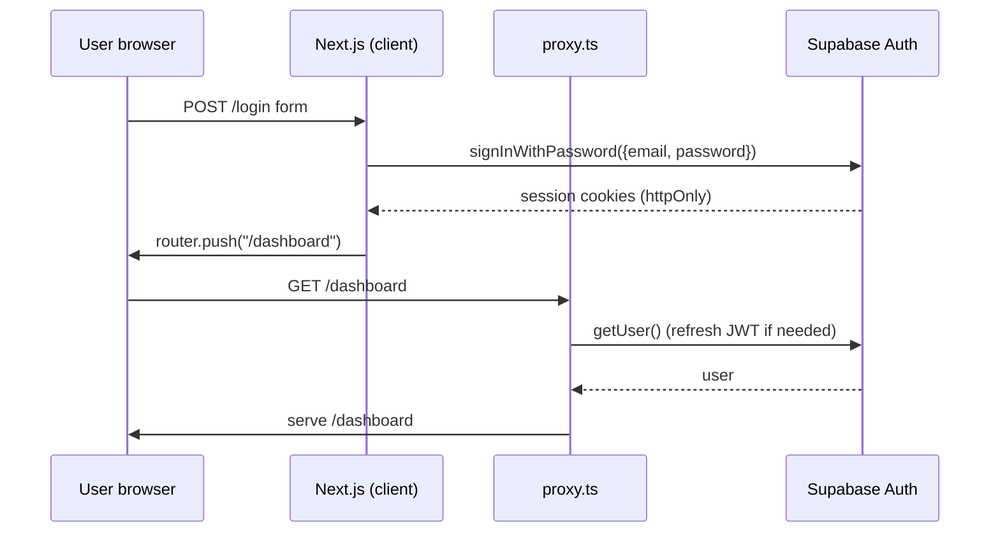
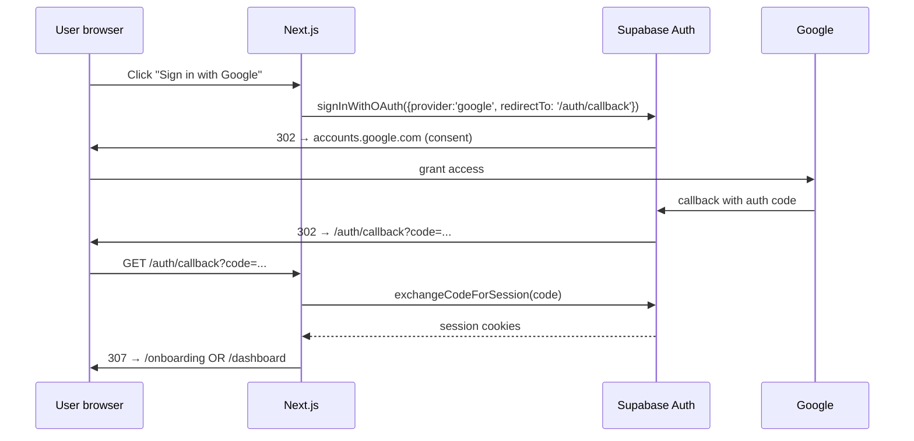
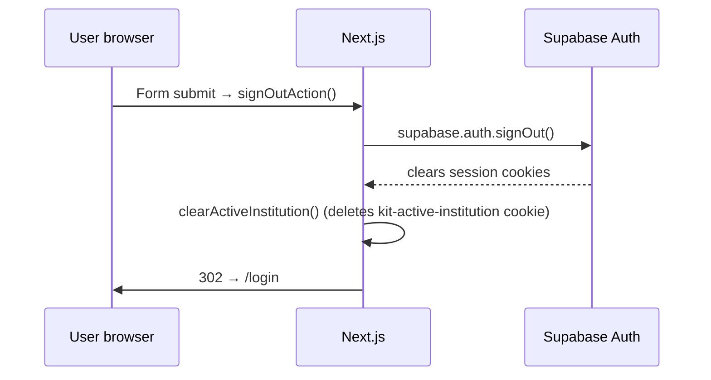

# Authentication & Authorization

Multi-tenant auth + RBAC for `kitithat-edu-ai-office`. Three layers, all required:

1. **Supabase Auth** — issues JWTs, manages identity, OAuth, password reset
2. **Next.js proxy** — refreshes the session on every request, redirects unauthenticated traffic
3. **Postgres RLS + RBAC catalog** — DB enforces tenant isolation; app layer enforces per-role permissions

The DB is the source of truth for tenant isolation — never the app. If the proxy and the RBAC helpers were entirely removed, the worst that would happen is users seeing redundant queries return zero rows; no data would leak across tenants.

---

## 1. Auth flow

### Sign-up



### Sign-in (email + password)



### Sign-in (Google OAuth)



> **Google OAuth setup is one-time, in the Supabase Dashboard** — see §6 below.

### Sign-out



---

## 2. Middleware architecture

Next.js 16 renamed `middleware.ts` to `proxy.ts`. Same signature, same matchers, runs on every non-static request.

```
[src/proxy.ts]
       │
       ▼
[src/lib/supabase/middleware.ts::updateSession]
       │
       ├── createServerClient(...) — wires cookies into the request/response cycle
       ├── supabase.auth.getUser() — triggers refresh if JWT expired
       │   ├── reads access_token cookie
       │   ├── verifies signature with Supabase JWT secret
       │   └── if expired: uses refresh_token to mint a new access_token
       └── if path is non-public AND no user: redirect → /login?next=<path>
```

Public paths (no auth required):

- `/`
- `/login`
- `/signup`
- `/auth/*` — OAuth callback, signout
- `/pricing`
- `/api/health`
- `/_next/*`
- `/favicon*`

Everything else triggers the redirect rule.

**Matchers** (proxy.ts config):
```ts
{
  matcher: [
    "/((?!_next/static|_next/image|favicon.ico|.*\\.(?:svg|png|jpg|jpeg|gif|webp|ico)$).*)",
  ],
}
```

This skips static assets — proxy doesn't run on `/_next/static/...`, image files, or the favicon. Anything else hits Supabase auth, which is critical because RSC pages need a refreshed JWT to query the DB.

---

## 3. Session management

The single entry point is `getSession()` in [src/lib/auth/session.ts](../src/lib/auth/session.ts). Call it from any Server Component or Server Action.

```ts
import { getSession, requireSession, requireRole, requireAdmin } from "@/lib/auth";

// Soft check — returns null if not signed in / no membership
const session = await getSession();
if (!session) return <Public />;

// Hard check — redirects to /login or /onboarding if needed
const session = await requireSession();

// Role gate — redirects to /dashboard?error=forbidden on mismatch
const session = await requireRole(["institution_admin", "department_head"]);

// Shorthand for institution_admin + super_admin
const session = await requireAdmin();
```

### Session shape

```ts
interface AuthenticatedSession {
  user: User;                   // from auth.users
  profile: Profile | null;      // from public.profiles
  memberships: Membership[];    // all institutions the user belongs to
  active: Membership;           // currently-selected institution (cookie hint)
  role: MemberRole;             // shorthand for active.role
}
```

### Active institution selection

A user may belong to multiple institutions. The active one is stored in an `httpOnly` cookie `kit-active-institution`. `getSession()`:

1. Reads the cookie hint
2. Confirms the user is still a member of that institution
3. Falls back to the first membership if missing or invalid

To switch:

```ts
import { setActiveInstitution } from "@/lib/auth";

await setActiveInstitution(targetInstitutionId);
// validates membership, writes cookie, calls revalidatePath("/", "layout")
```

The DB enforces isolation via RLS regardless — the cookie is just a UX hint about which tenant's data to show.

---

## 4. RBAC design

Defined in [src/lib/auth/rbac.ts](../src/lib/auth/rbac.ts). One catalog, used by both UI conditionals and Server Action guards.

### Role hierarchy (descending privilege)

| Role                | Scope                       | RANK |
|---------------------|-----------------------------|------|
| `super_admin`       | All tenants (platform staff)| 100  |
| `institution_admin` | One institution             | 80   |
| `department_head`   | One department + below      | 60   |
| `staff`             | One department (own work)   | 40   |
| `viewer`            | One department (read-only)  | 20   |

`super_admin` bypasses every per-role check in the app layer. RLS policies still apply — they explicitly include `or public.user_is_super_admin()` for cross-tenant reads where appropriate.

### Permission matrix

| Resource           | Action          | super | inst_admin | dept_head | staff | viewer |
|--------------------|-----------------|:-----:|:----------:|:---------:|:-----:|:------:|
| `institution`      | view            | ✔    | ✔          | ✔         | ✔     | ✔      |
| `institution`      | update          | ✔    | ✔          |           |       |        |
| `institution`      | manageBilling   | ✔    | ✔          |           |       |        |
| `member`           | invite          | ✔    | ✔          |           |       |        |
| `member`           | updateRole      | ✔    | ✔          |           |       |        |
| `member`           | remove          | ✔    | ✔          |           |       |        |
| `department`       | create          | ✔    | ✔          |           |       |        |
| `department`       | update          | ✔    | ✔          | ✔         |       |        |
| `document`         | create          | ✔    | ✔          | ✔         | ✔     |        |
| `document`         | update          | ✔    | ✔          | ✔         | ✔ *   |        |
| `document`         | delete          | ✔    | ✔          | ✔         |       |        |
| `document`         | publish         | ✔    | ✔          | ✔         |       |        |
| `workflow`         | initiate        | ✔    | ✔          | ✔         | ✔     |        |
| `workflow`         | approve         | ✔    | ✔          | ✔         |       |        |
| `workflow`         | cancel          | ✔    | ✔          |           |       |        |
| `ai`               | chat            | ✔    | ✔          | ✔         | ✔     |        |
| `ai`               | generateTor     | ✔    | ✔          | ✔         | ✔     |        |
| `ai`               | viewUsage       | ✔    | ✔          |           |       |        |
| `audit`            | view            | ✔    | ✔          |           |       |        |
| `platform`         | manageInstitutions | ✔ |            |           |       |        |

\* `staff` can update only documents they created — enforced at the row level by RLS, not by the app catalog.

### Using the catalog

```ts
import { can, sessionCan } from "@/lib/auth";

// Stateless check (use when you have a role string)
if (can("staff", "document", "create")) { ... }

// Session-aware check (use in components)
const session = await getSession();
if (sessionCan(session, "audit", "view")) {
  // render audit link
}
```

Conditionally hide UI affordances with `sessionCan()`; gate Server Actions with `requireRole()`. **Never trust the client.**

---

## 5. Protected routes

| Path                         | Who                                            | Mechanism                              |
|------------------------------|------------------------------------------------|----------------------------------------|
| `/`, `/login`, `/signup`     | Anyone (incl. anon)                            | Proxy whitelist                        |
| `/auth/*`, `/api/health`     | Anyone                                         | Proxy whitelist                        |
| `/onboarding`                | Authenticated, no membership yet               | Proxy + redirect to /dashboard if member |
| `/dashboard`, `/documents`, etc. | Authenticated + at least one membership   | Layout calls `requireSession()`        |
| `/admin`                     | `institution_admin` or `super_admin`           | Page calls `requireAdmin()`            |
| `/settings/profile`          | Authenticated                                  | Layout's `requireSession()` is sufficient |

### Server Action pattern

```ts
"use server";

import { requireRole } from "@/lib/auth";

export async function inviteMember(formData: FormData) {
  // 1. Authorize. requireRole() redirects on failure.
  const session = await requireRole(["institution_admin"]);

  // 2. Pull data. The session.active.institution_id is the tenant scope.
  const email = formData.get("email") as string;

  // 3. Mutate. RLS still applies — the supabase client uses the user's JWT.
  const supabase = await createSupabaseServerClient();
  await supabase.from("institution_members").insert({
    institution_id: session.active.institution_id,
    user_id: /* resolved from email */,
    role: "staff",
    invited_by: session.user.id,
  });
}
```

---

## 6. Supabase auth integration

### Provider config (Supabase Dashboard → Authentication)

**Email** (already on):

- Enable email confirmations: **ON** (recommended for production)
- Secure password change: ON
- Leaked password protection: ON (HaveIBeenPwned check)
- Confirm email template — customize in Thai

**Google OAuth** — needs one-time setup:

1. Google Cloud Console → APIs & Services → Credentials → **Create OAuth client ID**
   - Application type: Web application
   - Authorized JavaScript origins: `https://kitithatitman.com`, `http://localhost:3000`
   - Authorized redirect URIs:
     `https://<project-ref>.supabase.co/auth/v1/callback`
     For this project: `https://fqulleptlzncqyrmoyzv.supabase.co/auth/v1/callback`
2. Copy the Client ID + Client Secret
3. Supabase Dashboard → Authentication → Providers → **Google** → toggle on
4. Paste Client ID + Client Secret → Save
5. Reload the app — the `<Button>Google</Button>` on /login will now work

The Google button in [src/app/(auth)/login/login-form.tsx](../src/app/(auth)/login/login-form.tsx) calls `supabase.auth.signInWithOAuth({ provider: "google" })`. Until step 3 is done you'll see "provider not enabled" — visible in the auth logs.

### Site URL + redirect URLs

Dashboard → Authentication → URL Configuration:

- **Site URL**: `https://kitithatitman.com` (production)
- **Redirect URLs** (allow-list):
  - `http://localhost:3000/auth/callback`
  - `http://localhost:3001/auth/callback`
  - `http://localhost:3002/auth/callback`
  - `https://kitithatitman.com/auth/callback`

---

## 7. Type-safe utilities

Everything is exported from `@/lib/auth`:

```ts
// Session helpers (server-only)
getSession(): Promise<Session>
requireSession(redirectTo?: string): Promise<AuthenticatedSession>
requireRole(roles: MemberRole[], redirectTo?: string): Promise<AuthenticatedSession>
requireAdmin(redirectTo?: string): Promise<AuthenticatedSession>
sessionCan(session, resource, action): boolean

// Permission catalog (universal)
can(role, resource, action): boolean
PERMISSIONS: ReadonlyDeep<...>
ROLE_RANK: Record<MemberRole, number>
ADMIN_ROLES: readonly ["super_admin", "institution_admin"]

// Active institution
setActiveInstitution(id: string): Promise<void>    // Server Action
pickActiveMembership(memberships, hint): Membership | null
ACTIVE_INSTITUTION_COOKIE: "kit-active-institution"

// Sign out
signOutAction(): Promise<void>                      // Server Action
```

### Type narrowing

`requireSession()` returns `AuthenticatedSession` (non-nullable), so TypeScript narrows automatically:

```ts
const session = await requireSession();
//      ^? AuthenticatedSession (not Session)
const tenantId = session.active.institution_id;  // ✔ typed
const role: MemberRole = session.role;           // ✔ typed
```

`sessionCan(session, resource, action)` is generic on the resource — the `action` parameter is constrained to the valid actions for that resource:

```ts
sessionCan(session, "document", "create")  // ✔
sessionCan(session, "document", "spin")    // ✘ TS error
sessionCan(session, "plate", "fry")        // ✘ TS error (no 'plate' resource)
```

---

## File reference

| File                                              | What it owns                                                        |
|---------------------------------------------------|---------------------------------------------------------------------|
| [src/proxy.ts](../src/proxy.ts)                   | Next 16 proxy entrypoint — calls updateSession                      |
| [src/lib/supabase/middleware.ts](../src/lib/supabase/middleware.ts) | Cookie wiring + JWT refresh + path-based auth gate |
| [src/lib/supabase/server.ts](../src/lib/supabase/server.ts) | Server-side Supabase client (anon + service-role)            |
| [src/lib/supabase/client.ts](../src/lib/supabase/client.ts) | Browser Supabase client (anon only)                          |
| [src/lib/auth/session.ts](../src/lib/auth/session.ts) | getSession / requireSession / requireRole / requireAdmin       |
| [src/lib/auth/rbac.ts](../src/lib/auth/rbac.ts)   | PERMISSIONS catalog + can() + role ranks                            |
| [src/lib/auth/active-institution.ts](../src/lib/auth/active-institution.ts) | Cookie read/write + pickActiveMembership            |
| [src/lib/auth/actions.ts](../src/lib/auth/actions.ts) | Server Actions: setActiveInstitution, signOutAction            |
| [src/app/auth/callback/route.ts](../src/app/auth/callback/route.ts) | OAuth code → session exchange                          |
| [supabase/migrations/0003_rls_policies.sql](../supabase/migrations/0003_rls_policies.sql) | DB-layer tenant isolation + role checks |
